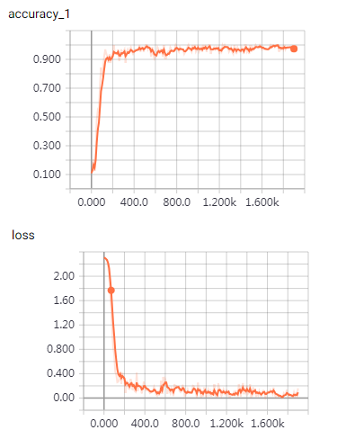
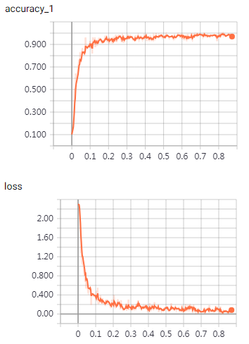

# 项目内容
本项目主要针对文本分类场景，尝试目前流行的深度学习模型，通过不同的`embedding`方式，对比文本分类效果，实现文本分类的目的。  

主要模型：
- Text Classification with CNN
- Text Classification with RNN

------
# Text Classification with CNN
使用基于tensorflow的卷积神经网络进行中文文本分类。  
本项目引用借鉴：https://github.com/gaussic/text-classification-cnn-rnn

## 环境

| 模块 | 版本 |
| :----------: | :----------: |
| python | 2.7.13 |
| tensorflow | 1.10.0 |
| numpy | 1.16.2 |
| scikit-learn | 0.19.0 |
| scipy | 0.19.1 |

## 数据集
使用THUCNews的一个子集进行训练与测试，数据集请自行到[THUCTC：一个高效的中文文本分类工具包](http://thuctc.thunlp.org/)下载，请遵循数据提供方的开源协议。  
本项目使用THUCNews数据集所有类别共计10个，每个类别6500条数据。    
类别如下：  

```
体育, 娱乐, 家居, 教育, 时政, 游戏, 社会, 科技, 股票, 财经
```

数据集划分如下：  

| 训练集 | 验证集 | 测试集 |
| :----------: | :----------: | :----------: |
| 5000*10 | 500*10 | 1000*10 |

从原始数据集生成子集的过程参考`helper`下的两个脚本。其中，`copy_data.py`用于从每个分类拷贝6500个文件，`cnews_group.py`用于将多个文件整合到一个文件中。执行`cnews_loader.py`文件后，得到三个数据文件。   
链接: https://pan.baidu.com/s/1hugrfRu 密码: qfud 。下载或者生成`cnews.train.txt, cnews.val.txt, cnews.test.txt`三个文件之后，运行`data`下的`cnews_seg.py`脚本，用于生成训练集分词文件、验证集分词文件、测试集分词文件和以词为单位的词汇表文件。
下载链接：https://pan.baidu.com/s/1KuzMatR8twNSQNVTSHiycQ 密码: p1io 。

| 文件 | 类型 | 数目 |
| :---------- | :---------- | :---------- |
| cnews.train.txt | 训练集 | 50000 |
| cnews.val.txt | 验证集 | 5000 |
| cnews.test.txt | 测试集 | 10000 |
| cnews.train.seg.txt | 训练集分词文件 | 50000 |
| cnews.val.seg.txt | 验证集分词文件 | 5000 |
| cnews.test.seg.txt | 测试集分词文件 | 10000 |

## 预处理

`data/cnews_loader.py`为数据的预处理文件。

| 函数        | 说明        |  
| :---------- | :---------- |
| read_file() | 读取文件数据 |
| build_vocab() | 构建词汇表，长度5000，使用字符级的表示，这一函数会将词汇表存储下来，避免每一次重复处理 |
| read_vocab()  | 读取上一步存储的词汇表，转换为`{词：id}`表示 |
| read_category() | 将分类目录固定，转换为`{类别: id}`表示 |
| to_words() | 将一条由id表示的数据重新转换为文字 |
| process_file() | 将数据集从文字转换为固定长度的id序列表示 |
| batch_iter() | 为神经网络的训练准备经过shuffle的批次的数据 |

`data/cnews_seg.py`为数据的分词文件。

| 函数        | 说明        |  
| :---------- | :---------- |
| check_number() | 判断一个字符串是否为数字，用于筛掉一篇文档里的数字 |
| load_stopwords() | 导入常见停用词，用于筛掉一篇文档里的停用词 |
| read_file_seg()  | 读取文件并进行分词 |
| build_vocab() | 利用训练集生成词汇表（使用词语级表示），长度3000 |

经过数据预处理，数据的格式如下，其中`seq_length`为单篇文档的`embedding`序列长度，当使用`char`字符级别时`seq_length=600`，当使用`word`词语级别时`seq_length=400`：

| Data | Shape | Data | Shape |
| :---------- | :---------- | :---------- | :---------- |
| x_train | [50000, seq_length] | y_train | [50000, 10] |
| x_val | [5000, seq_length] | y_val | [5000, 10] |
| x_test | [10000, seq_length] | y_test | [10000, 10] |

## CNN卷积神经网络

### 配置项

CNN可配置的参数如下所示，在`cnn_model.py`中。

```python
class TCNNConfig(object):
    """CNN配置参数"""

    embedding_dim = 64      # 词向量维度
    seq_length = 600        # 序列长度,600(char),400(word)
    num_classes = 10        # 类别数
    num_filters = 128        # 卷积核数目
    kernel_size = 5         # 卷积核尺寸
    vocab_size = 5000       # 词汇表达小,5000(char),3000(word)

    hidden_dim = 128        # 全连接层神经元

    dropout_keep_prob = 0.5 # dropout保留比例
    learning_rate = 1e-3    # 学习率

    batch_size = 64         # 每批训练大小
    num_epochs = 10         # 总迭代轮次

    print_per_batch = 100    # 每多少轮输出一次结果
    save_per_batch = 10      # 每多少轮存入tensorboard
```

### CNN模型

具体参看`cnn_model.py`的实现。

大致结构如下：


### 训练与验证-字符级

运行 `python run_cnn.py train char `，可以开始训练。

> 若之前进行过训练，请把tensorboard/textcnn删除，避免TensorBoard多次训练结果重叠。

```
Epoch: 3
Iter:   1600, Train Loss:   0.03, Train Acc: 100.00%, Val Loss:   0.18, Val Acc:  95.18%, Time: 0:00:28 
Iter:   1700, Train Loss:  0.099, Train Acc:  96.88%, Val Loss:   0.18, Val Acc:  95.02%, Time: 0:00:30 
Iter:   1800, Train Loss:  0.052, Train Acc:  96.88%, Val Loss:   0.19, Val Acc:  94.88%, Time: 0:00:32 
Iter:   1900, Train Loss:  0.043, Train Acc:  98.44%, Val Loss:   0.19, Val Acc:  95.00%, Time: 0:00:33 
Iter:   2000, Train Loss:  0.082, Train Acc:  96.88%, Val Loss:    0.2, Val Acc:  94.70%, Time: 0:00:35 
Iter:   2100, Train Loss:  0.088, Train Acc:  98.44%, Val Loss:   0.18, Val Acc:  94.96%, Time: 0:00:36 
Iter:   2200, Train Loss:  0.017, Train Acc: 100.00%, Val Loss:   0.19, Val Acc:  94.86%, Time: 0:00:38 
Iter:   2300, Train Loss:  0.059, Train Acc:  98.44%, Val Loss:   0.18, Val Acc:  95.36%, Time: 0:00:40 
No optimization for a long time, auto-stopping...
```

当使用字符级别embedding时，在验证集上的最佳效果为95.36%，且只经过了3轮迭代就已经停止。

准确率和误差如图所示：


### 测试-字符级

运行 `python run_cnn.py test char ` 在测试集上进行测试。

```
Test Loss:   0.12, Test Acc:  96.60%
Precision, Recall and F1-Score...
             precision    recall  f1-score   support

         体育       0.99      0.99      0.99      1000
         财经       0.95      0.99      0.97      1000
         房产       1.00      0.99      1.00      1000
         家居       0.97      0.90      0.93      1000
         教育       0.94      0.95      0.94      1000
         科技       0.97      0.97      0.97      1000
         时尚       0.94      0.98      0.96      1000
         时政       0.96      0.94      0.95      1000
         游戏       0.98      0.97      0.98      1000
         娱乐       0.97      0.97      0.97      1000

avg / total       0.97      0.97      0.97     10000


Confusion Matrix...
[[992   0   0   1   5   1   0   1   0   0]
 [  0 995   0   0   0   1   0   4   0   0]
 [  1   1 995   1   2   0   0   0   0   0]
 [  2  19   1 904  18   8  17  22   3   6]
 [  2   7   0   6 946   6  12  10   5   6]
 [  0   3   0   5   3 967  14   1   6   1]
 [  1   0   0   6   5   4 977   0   0   7]
 [  0  21   1   6  20   9   0 937   1   5]
 [  1   3   0   1   4   2  12   0 972   5]
 [  1   0   0   5   8   3   6   0   2 975]]

```

当使用字符级别embedding时，在测试集上的准确率达到了96.6%，且各类的precision, recall和f1-score都超过了0.9。从混淆矩阵也可以看出分类效果非常优秀。

### 训练与验证-词语级

运行 `python run_cnn.py train word `，可以开始训练。

> 若之前进行过训练，请把tensorboard/textcnn删除，避免TensorBoard多次训练结果重叠。

```
Epoch: 3
Iter:   1600, Train Loss:  0.059, Train Acc:  96.88%, Val Loss:    0.2, Val Acc:  94.26%, Time: 0:00:21 
Iter:   1700, Train Loss:  0.026, Train Acc: 100.00%, Val Loss:   0.17, Val Acc:  95.42%, Time: 0:00:22 
Iter:   1800, Train Loss:  0.056, Train Acc:  98.44%, Val Loss:   0.17, Val Acc:  95.34%, Time: 0:00:23 
Iter:   1900, Train Loss:   0.13, Train Acc:  95.31%, Val Loss:   0.17, Val Acc:  95.32%, Time: 0:00:24 
No optimization for a long time, auto-stopping...

```

当使用词语级别embedding时，在验证集上的最佳效果为95.32%，经过了3轮迭代就已经停止。

准确率和误差如图所示：




### 测试-词语级

运行 `python run_cnn.py test word ` 在测试集上进行测试。

```
Test Loss:   0.11, Test Acc:  96.86%
Precision, Recall and F1-Score...
             precision    recall  f1-score   support

         体育       1.00      1.00      1.00      1000
         财经       0.97      0.99      0.98      1000
         房产       1.00      0.99      0.99      1000
         家居       0.94      0.92      0.93      1000
         教育       0.96      0.92      0.94      1000
         科技       0.94      0.98      0.96      1000
         时尚       0.96      0.97      0.97      1000
         时政       0.95      0.96      0.95      1000
         游戏       0.99      0.97      0.98      1000
         娱乐       0.98      0.98      0.98      1000

avg / total       0.97      0.97      0.97     10000

Confusion Matrix...
[[997   0   0   0   0   0   0   2   0   1]
 [  0 992   0   1   0   0   1   6   0   0]
 [  0   1 991   2   1   0   1   2   1   1]
 [  0  13   0 915  10  16  20  18   5   3]
 [  1   5   0  13 924  22   5  23   1   6]
 [  0   0   0   7   6 976   2   2   6   1]
 [  0   0   0  17   4   2 974   1   0   2]
 [  0   9   1   4  15   8   0 962   1   0]
 [  0   2   0   7   3   8   9   0 970   1]
 [  0   1   0   3   4   4   3   0   0 985]]

```

当使用字符级别embedding时，在测试集上的准确率达到了96.86%，且各类的precision, recall和f1-score都超过了0.9。从混淆矩阵也可以看出分类效果非常优秀。

## RNN循环神经网络

### 配置项

RNN可配置的参数如下所示，在`rnn_model.py`中。

```python
class TRNNConfig(object):
    """RNN配置参数"""

    # 模型参数
    embedding_dim = 64      # 词向量维度
    seq_length = 600        # 序列长度,600(char),400(word)
    num_classes = 10        # 类别数
    vocab_size = 5000       # 词汇表达小,5000(char),3000(word)

    num_layers= 2           # 隐藏层层数
    hidden_dim = 128        # 隐藏层神经元
    rnn = 'gru'             # lstm 或 gru

    dropout_keep_prob = 0.8 # dropout保留比例
    learning_rate = 1e-3    # 学习率

    batch_size = 128         # 每批训练大小
    num_epochs = 10          # 总迭代轮次

    print_per_batch = 100    # 每多少轮输出一次结果
    save_per_batch = 10      # 每多少轮存入tensorboard
```

### RNN模型

具体参看`rnn_model.py`的实现。

大致结构如下：


### 训练与验证-字符级

> 这部分的代码与 run_cnn.py极为相似，只需要将模型和部分目录稍微修改。

运行 `python run_rnn.py train char`，可以开始训练。

> 若之前进行过训练，请把tensorboard/textrnn删除，避免TensorBoard多次训练结果重叠。

```
Epoch: 8
Iter:   2800, Train Loss: 0.0052, Train Acc: 100.00%, Val Loss:   0.34, Val Acc:  91.82%, Time: 0:49:05 
Iter:   2900, Train Loss:  0.043, Train Acc:  99.22%, Val Loss:   0.39, Val Acc:  91.26%, Time: 0:50:49 
Iter:   3000, Train Loss:  0.068, Train Acc:  97.66%, Val Loss:   0.33, Val Acc:  91.54%, Time: 0:52:34 
No optimization for a long time, auto-stopping...

```
当使用字符级别embedding时，在验证集上的最佳效果为91.54%，经过了8轮迭代停止，速度相比CNN慢很多。

准确率和误差如图所示：




### 测试-字符级

运行 `python run_rnn.py test char` 在测试集上进行测试。

```
Test Loss:    0.2, Test Acc:  94.94%
Precision, Recall and F1-Score...
             precision    recall  f1-score   support

         体育       0.98      0.98      0.98      1000
         财经       0.95      0.97      0.96      1000
         房产       1.00      1.00      1.00      1000
         家居       0.94      0.87      0.90      1000
         教育       0.85      0.95      0.90      1000
         科技       0.93      0.98      0.95      1000
         时尚       0.92      0.97      0.94      1000
         时政       0.97      0.90      0.93      1000
         游戏       0.96      0.95      0.96      1000
         娱乐       0.99      0.93      0.96      1000

avg / total       0.95      0.95      0.95     10000

Confusion Matrix...
[[981   0   0   0  12   4   0   0   3   0]
 [  9 974   0   1   5   1   0   6   3   1]
 [  0   0 996   3   1   0   0   0   0   0]
 [  1   4   0 870  63  17  25  13   4   3]
 [  2  13   1   6 949  13   6   6   3   1]
 [  0   1   0  10   5 976   0   1   7   0]
 [  1   0   0  14  10   1 967   0   4   3]
 [  0  28   0   9  49  14   0 898   1   1]
 [  2   1   0   3   7   8  29   0 950   0]
 [  0   3   0   7   9  12  20   2  14 933]]

```
在测试集上的准确率达到了94.94%，且各类的precision, recall和f1-score，除了家居这一类别，都超过了0.9。

从混淆矩阵可以看出分类效果非常优秀。

对比两个模型，可见RNN除了在家居分类的表现不是很理想，其他几个类别较CNN差别不大。

还可以通过进一步的调节参数，来达到更好的效果。
